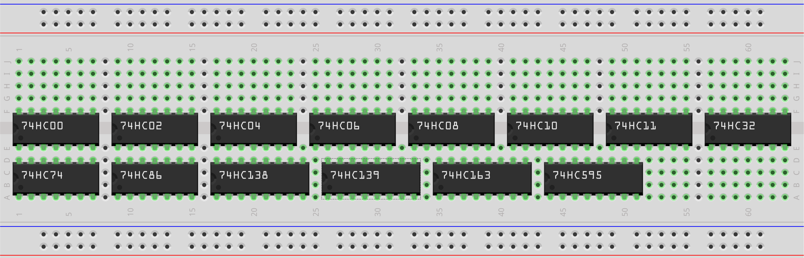

# Fritzing_74HCxx (https://fritzing.org/)

Library of 74HCxx ICs for Fritzing

Current support:
  - 74HC00 - Quad 2-input NAND gate
  - 74HC02 - Quad 2-input NOR gate
  - 74HC04 - Hex Inverter
  - 74HC06 - Hex Inverter buffer/driver
  - 74HC08 - Quad 2-input AND gate
  - 74HC10 - Triple 3-input NAND gate
  - 74HC11 - Triple 3-input AND gate
  - 70HC20 - Dual 4-input NAND gate
  - 70HC27 - Triple 3-input NOR gate
  - 70HC30 - 8-input NAND gate
  - 74HC32 - Quad 2-input OR gate
  - 70HC42 - BCD to decimal decoder (1-of-10)
  - 70HC51 - DUAL 2 WIDE 2 INPUT AND/OR INVERT GATE
  - 74HC74 - Dual D-type flip-flop with set andreset; positive-edge trigger
  - 74HC86 - Quad 2-input EXCLUSIVE-OR gate
  - 74HC138 - 3-to-8 line decoder/demultiplexer; inverting 
  - 74HC139 - Dual 2-to-4 linedecoder/demultiplexer
  - 74HC161 - Presettable synchronous 4-bitbinary counter; asynchronous reset
  - 74HC163 - Presettable synchronous 4-bitbinary counter; synchronous reset
  - 74HC245 - Octal bus tranceiver; 3-state
  - 74HC273 - Octal D-type flip-flop with reset;positive-edge trigger
  - 74HC283 - 4-bit binary full adder with fast carry
  - 74HC299 - 8-bit universal shift register; 3-state
  - 74HC595 - 8-bit serial-in, serial or parallel-outshift register with output latches;3-state
  - 74HC4078 - 8-INPUT NOR/OR GATE

In Progress:

  - 70HC58
  - 70HC73
  - 70HC4002
  - 70HC4851
  - 70HC7014
   
	